# Hotel Cannes Management System
Custom Hotel Management System with real-time operations and hardware integrations

## About the Project
This project is a **custom hotel management system** developed for **Hotel Cannes** (Mar del Plata, Argentina).  
The system was designed to **replace an obsolete multi-application tool** that had become error-prone, unintuitive, and difficult to maintain.

The new solution centralizes all hotel operations into a **Single Page Application (SPA)** with:

- **Real-time updates** for room and shift management.
- **Intuitive UX/UI**, designed to simplify workflows and reduce training needs.
- **Remote accessibility**, allowing the hotel owner to monitor and manage operations from anywhere.
- **Tailored features**, built to match the specific operational requirements of the hotel.

---

## 🛠️ Technologies Used

**Frontend:**
- React.js (SPA)
- JSX, CSS3

**Backend:**
- Node.js
- Express.js
- WebSockets (real-time updates)
- Java (integration with fingerprint SDK)

**Database:**
- MySQL (managed via XAMPP, JPA for Java integration)

**Other Tools:**
- Git & GitHub (version control)
- Trello (project management & agile methodologies)
- Figma (UX/UI prototyping)

---

## 🚀 Getting Started

### Prerequisites
- [Node.js](https://nodejs.org/) 18 or 20 (LTS) and npm. Newer major versions may fail to load the native `serialport` module (used for the RFID reader) if it wasn't rebuilt for that Node ABI — this only affects the hardware-integration endpoints, not the rest of the API.
- MySQL / MariaDB (e.g. via [XAMPP](https://www.apachefriends.org/)).

### 1. Clone the repository
```bash
git clone https://github.com/Facupancani/cannes-backend.git
cd cannes-backend
```

### 2. Install dependencies
```bash
npm install
```

### 3. Configure environment variables
Copy the example file and fill in your local values:
```bash
cp .env.example .env
```
| Variable | Description | Default |
|---|---|---|
| `PORT` | Port the Express server listens on | `3000` |
| `DB_NAME` | MySQL database name | `cannes_db` |
| `DB_USER` | MySQL user | `root` |
| `DB_PASSWORD` | MySQL password | *(empty)* |
| `DB_HOST` | MySQL host | `localhost` |
| `DB_DIALECT` | Sequelize dialect | `mysql` |

### 4. Create the database
Create a database matching `DB_NAME` and import the provided schema + sample data:
```bash
mysql -u root -p cannes_db < cannes_db.sql
```
(or import `cannes_db.sql` from phpMyAdmin if you're using XAMPP). The seed data (users, advances, cash movements, etc.) is anonymized/fictional so the project can be run locally without any real guest or staff data.

### 5. Run the server
```bash
npm run dev     # development, with auto-reload (nodemon)
npm start       # production
```
The API is served at `http://localhost:3000` (or whatever `PORT` you set).

### About `/public`
This server also serves the frontend's production build (React + Vite) as static files from `public/`, via `express.static` + a SPA fallback in [server.js](server.js) — so the whole app (backend + frontend) can be shipped and installed at the hotel as a single deployable unit. The frontend source lives in a separate repository, [cannes-hotel-sistema](https://github.com/LucianoFrias/cannes-hotel-sistema); to refresh this build, run `npm run build` there and copy the resulting `dist/` contents into `public/`.

---

## 📡 Integrations & Methodologies

### 🔌 Hardware Integrations
- **RFID Card Reader (RS232):** Used for guest check-ins/check-outs. Integrated via serial communication with Node.js backend.  
- **Fingerprint Scanner (DigitalPersona U.are.U 4500):** Integrated using the official Java SDK and exposed through a REST API, connected to the main system for biometric authentication.  

### Real-Time Communication
- **WebSockets:** Implemented for instant updates of room states, shift data, and stock changes across all active sessions.  

### Project Management
- **Agile / Scrum:** Managed tasks and sprints with Trello boards.  

### 🎨 Design & Prototyping
- **Figma:** Prototyped UI/UX flows before implementation to validate with the client.  

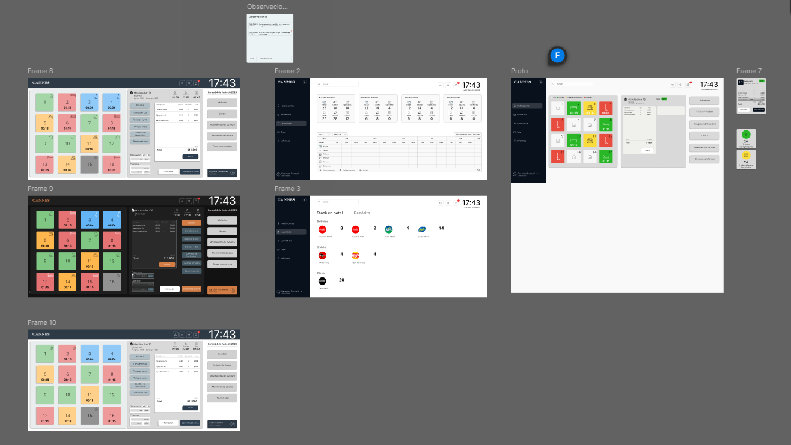  
*Sample design mockups created in Figma during the early prototyping phase.*

---

## 🎯 Problem & Solution

### Problem
The hotel’s previous system presented several critical issues:

- Built as **three separate applications** with 20+ windows and tabs, making it cumbersome and inefficient.  
- Increasingly **unstable**, with frequent errors and no available technical support.  
- **Abandoned by staff** in favor of manual spreadsheets and lists, as the system no longer met their needs.  
- Lacked essential features such as **remote access**, streamlined shift handling, and real-time consumptions/laundry tracking.  

### Solution
To address these issues, we developed a **modern SPA** tailored to the hotel’s operations:

- **Simplified UX/UI:** Consolidated all windows and tabs into a clean, minimalistic interface.  
- **Remote Access:** Web-based design enables the owner to supervise and manage operations remotely.  
- **Real-Time Operations:** Integrated WebSockets for instant room, shift, and stock updates.  
- **Automated Processes:** Cash, consumptions, and laundry tracking to reduce manual errors.  
- **Hardware Integration:** RFID card reader for check-ins/check-outs and fingerprint scanner for secure staff authentication.  
- **Role Management:** Role-based access control for administrators and concierges.  
- **Scalability:** Flexible architecture prepared for future expansions or new features.  

---

## 🧩 System Structure & Features
The following sections describe the main functional modules of the system,
organized by hotel operations. Each feature includes screenshots and demos
for clarity.

---

## 🏨 Room States
The system tracks multiple room states with real-time updates through WebSockets:

- **Occupied:** Shows check-in/out times, time remaining, and allows discounts, adding consumptions, renewals, and observations.  
- **Pending Cleaning:** Displays a timer and button to start cleaning manually.  
- **Cleaning in Progress:** Shows cleaning duration, a form for registering laundry, and automatically updates room availability.  
- **Available / Free:** Shows recent history, option to start a manual shift, and maintenance toggle.  
- **Maintenance:** Room cannot be booked until marked as available again.  

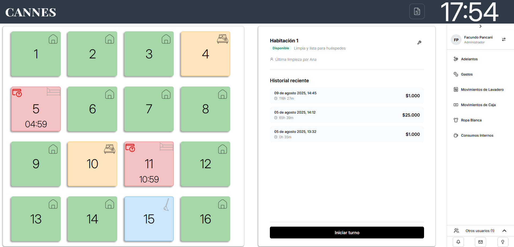  
*SPA layout showing the room grid, interactive room window, and side navigation.*

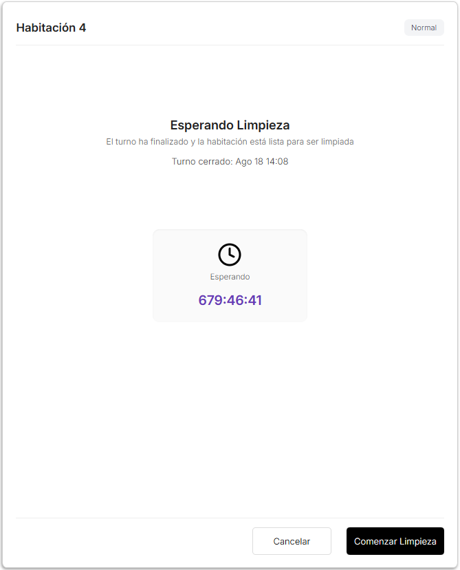  
*Room marked as pending cleaning, with timer and manual cleaning option.*

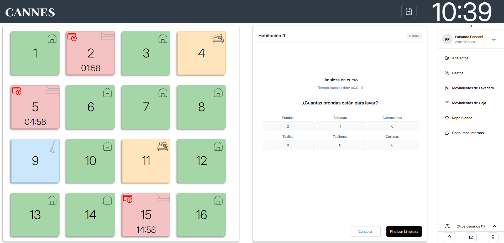  
*Cleaning state with timer and integrated laundry registration form.*

---

## ⏱️ Shift Management
- Start and manage room shifts manually.  
- Renew or extend shifts.  
- Apply discounts or surcharges.  
- Add observations and consumptions to a shift.  

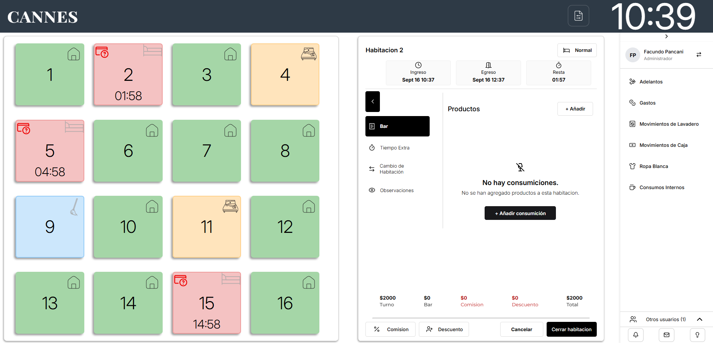  
*Dynamic shift management window with options for consumptions, renewals, and discounts.*

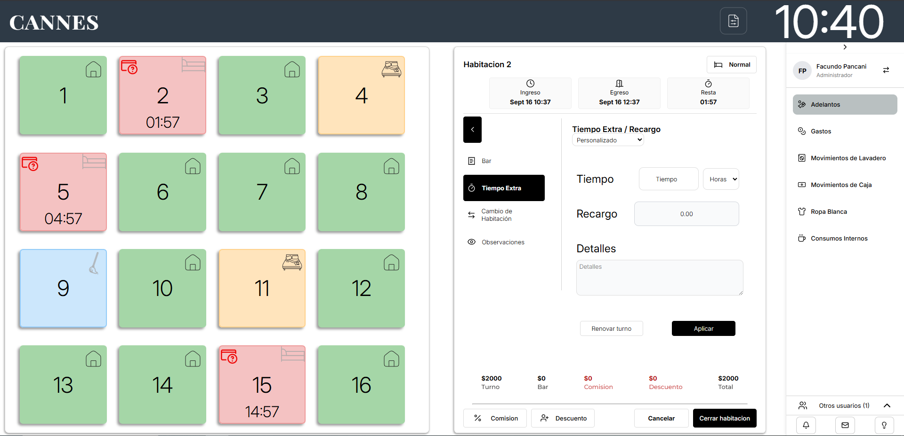  
*Modal for applying surcharges, shift renewals, or extra time.*  

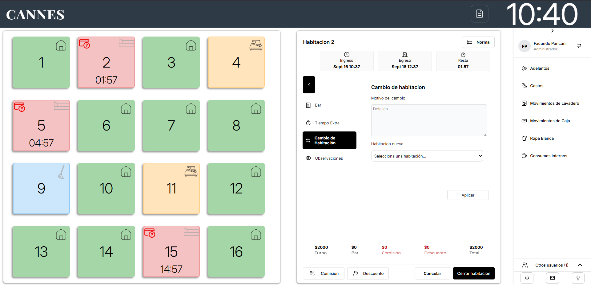  
*Video demonstration of changing a room assignment during an active shift.*  

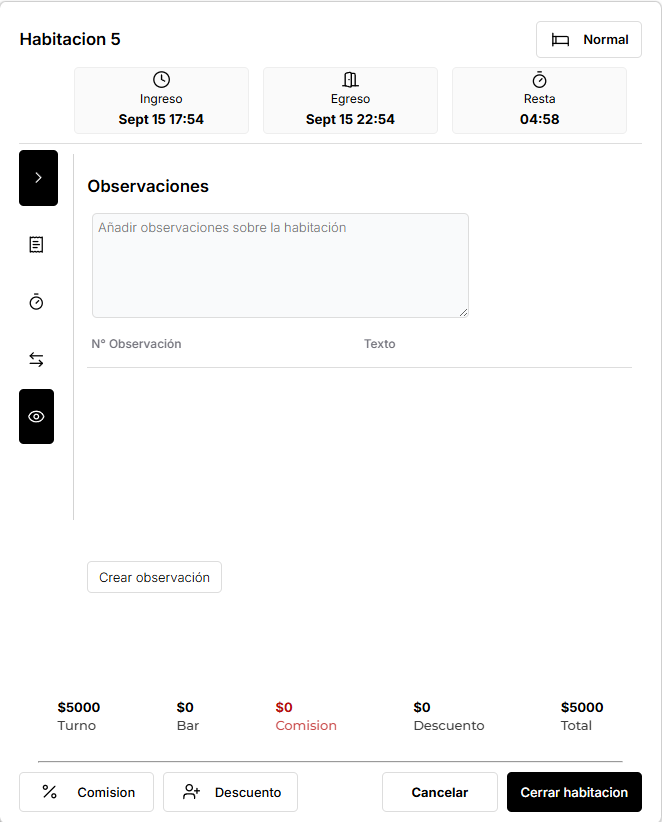  
*Interactive panel for recording observations and notes per shift.*  

[Commission & Discount Demo](src/assets/vids/comision-discount.mp4)  
*Video demo showing the process of applying commissions and discounts.*  

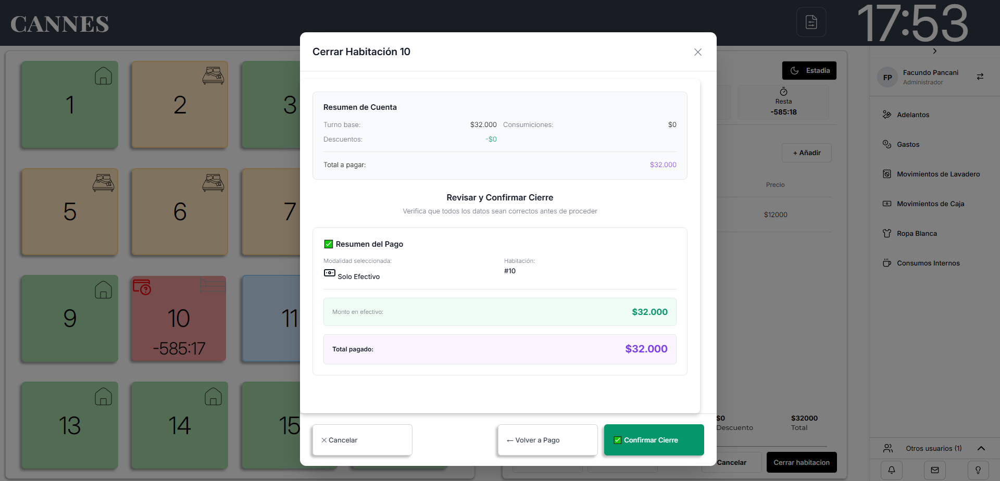  
*Close room modal where the user selects payment method (cash, card, or mixed) and verifies amounts before finalizing.*  

---

## 📌 Side Navigation Panel Features

### Advances
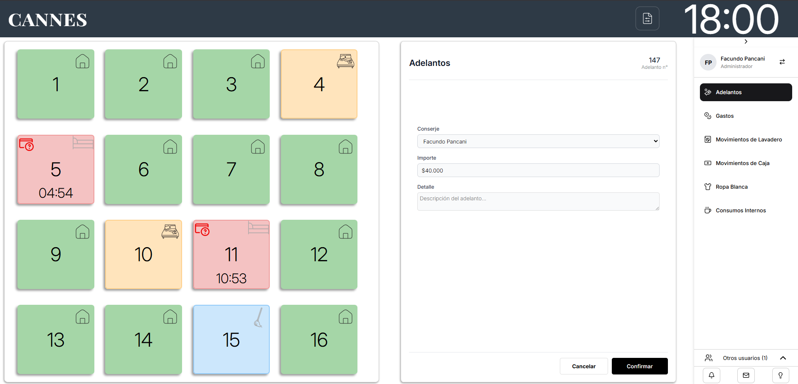  
*Module for registering staff advances (concierges).*  

### Expenses
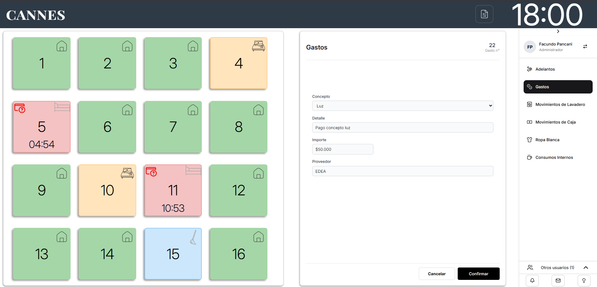  
*Expense registration and tracking with detailed records.*  

### Laundry Movements
[Laundry Movements Demo](src/assets/vids/laundryMovements.mp4)  
*Video demonstration of real-time laundry operations and inventory updates.*  

### Cash Movements
[Cash Movements Demo](src/assets/vids/cashMovements.mp4)  
*Video demonstration of detailed cash operations with filtering and categorization.*  

### Linen / Stock Control
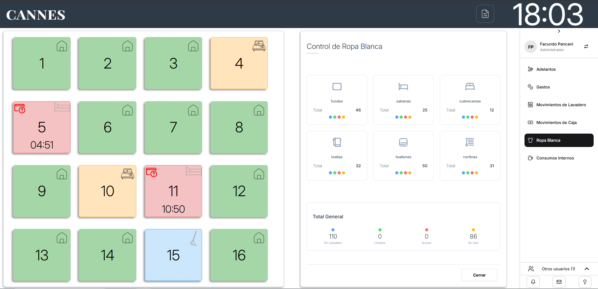  
*Stock control module for linens and related inventory.*  

### Internal Consumptions
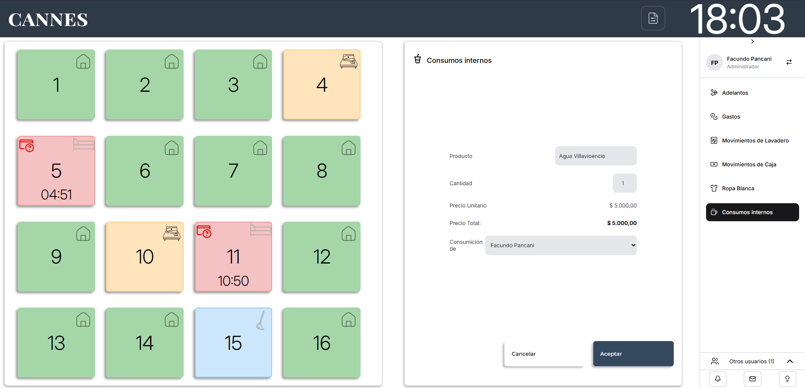  
*Interface for recording internal consumptions made by staff.*  

---

## 🖥️ UI & UX
SPA with a minimalistic and user-friendly interface.  
Includes dark mode support, interactive dynamic windows, and a collapsible side navigation with quick access buttons.  

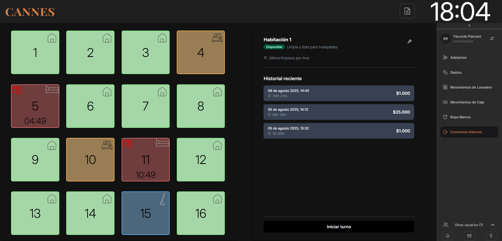  
*Dark mode interface designed for night shifts and low-light environments.*  

---

## 👥 Developers
This project was developed by two developers:

- **Facundo Pancani**  
  📧 facupancani@gmail.com  
  🔗 [Portfolio](https://facupancani.github.io/Portfolio/)  
  💼 [LinkedIn](https://www.linkedin.com/in/facundopancani/)  

- **Luciano Frias**  
  📧 lucianofrias1@hotmail.com  
  🔗 [Portfolio](https://lucianofrias.github.io/portfolio/#/)  
  💼 [LinkedIn](https://www.linkedin.com/in/luciano-frias-1439b71b7/)  

